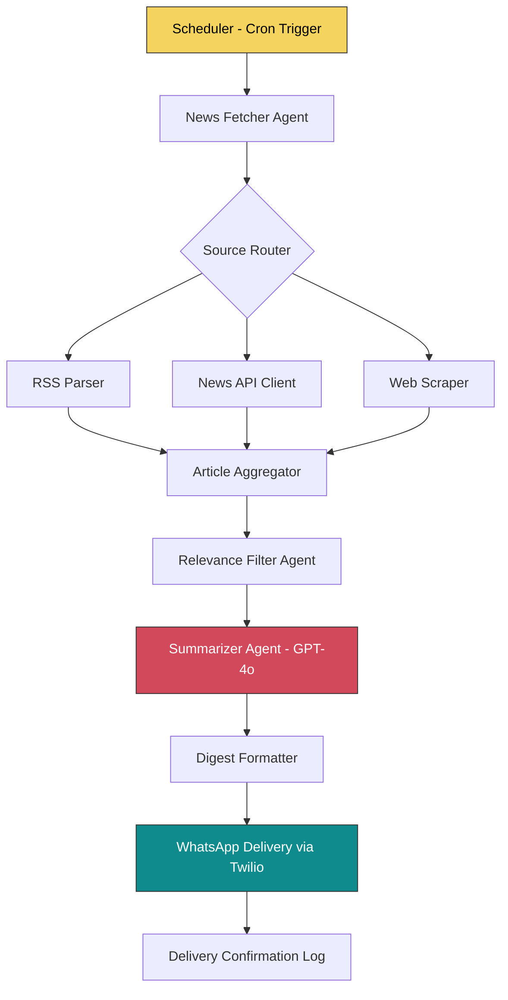

# How I Built an Autonomous News Agent with LangGraph

Building AI agents that actually *work* in production is harder than most tutorials make it seem. In this post, I'll walk you through how I built **NewsAgent AI** — an autonomous system that fetches, filters, summarizes, and delivers curated news digests via WhatsApp.

> "The best AI agents don't just respond to prompts — they orchestrate complex workflows with minimal human intervention."

## The Problem

I was tired of manually scrolling through dozens of news sites every morning. I wanted a system that could:

1. **Fetch** news from multiple sources (RSS feeds, APIs, web scraping)
2. **Filter** articles based on my interests (AI, tech, startups)
3. **Summarize** each article into a concise 2-3 sentence digest
4. **Deliver** the curated digest to my WhatsApp every morning at 8 AM

Sounds simple? The devil is in the details — especially when you need reliability, error handling, and graceful degradation.

## Architecture Overview

Here's the high-level architecture of NewsAgent AI:




## The Tech Stack

| Component | Technology |
|-----------|-----------|
| Orchestration | LangGraph |
| LLM | GPT-4o via OpenAI API |
| News Sources | NewsAPI, RSS (feedparser) |
| Delivery | Twilio WhatsApp API |
| Scheduling | APScheduler |
| Storage | SQLite for article dedup |
| Deployment | Docker + Railway |

## Building the Agent Graph

The core of NewsAgent is a **LangGraph state machine**. Each node in the graph represents an agent or processing step, and edges define the flow control.

Here's the simplified graph definition:

```python
from langgraph.graph import StateGraph, END
from typing import TypedDict, List

class NewsState(TypedDict):
    raw_articles: List[dict]
    filtered_articles: List[dict]
    summaries: List[str]
    digest: str
    delivery_status: str

def fetch_news(state: NewsState) -> NewsState:
    """Fetch articles from multiple sources."""
    articles = []
    articles.extend(fetch_from_rss(FEED_URLS))
    articles.extend(fetch_from_newsapi(TOPICS))
    return {"raw_articles": deduplicate(articles)}

def filter_relevant(state: NewsState) -> NewsState:
    """Use LLM to score article relevance."""
    relevant = []
    for article in state["raw_articles"]:
        score = relevance_scorer.invoke(article)
        if score > 0.7:
            relevant.append(article)
    return {"filtered_articles": relevant[:15]}

def summarize_articles(state: NewsState) -> NewsState:
    """Generate concise summaries using GPT-4o."""
    summaries = []
    for article in state["filtered_articles"]:
        summary = summarizer_chain.invoke({
            "title": article["title"],
            "content": article["content"]
        })
        summaries.append(summary)
    return {"summaries": summaries}

# Build the graph
workflow = StateGraph(NewsState)
workflow.add_node("fetch", fetch_news)
workflow.add_node("filter", filter_relevant)
workflow.add_node("summarize", summarize_articles)
workflow.add_node("format", format_digest)
workflow.add_node("deliver", send_whatsapp)

workflow.set_entry_point("fetch")
workflow.add_edge("fetch", "filter")
workflow.add_edge("filter", "summarize")
workflow.add_edge("summarize", "format")
workflow.add_edge("format", "deliver")
workflow.add_edge("deliver", END)

app = workflow.compile()
```

## The Relevance Filter

One of the trickiest parts was building a reliable relevance filter. I used a simple but effective approach — a structured prompt with few-shot examples:

```python
RELEVANCE_PROMPT = """
You are a news relevance scorer. Rate the following article's 
relevance to these topics: AI, Machine Learning, Startups, Python.

Article Title: {title}
Article Snippet: {snippet}

Return a JSON object: {{"score": 0.0-1.0, "reason": "brief explanation"}}
"""
```

This approach gave me ~90% accuracy in filtering relevant articles, which was good enough for a daily digest.

## Lessons Learned

After running NewsAgent in production for 3 months, here are my key takeaways:

- **Error handling is everything.** News APIs go down, rate limits hit, and HTML structures change. Build retry logic and fallback sources from day one.
- **LLM costs add up.** Summarizing 50+ articles daily with GPT-4o isn't cheap. I switched to batching and using GPT-4o-mini for relevance scoring to cut costs by 60%.
- **Deduplication is non-trivial.** The same story appears across multiple sources with different titles. I used a combination of URL normalization and embedding similarity to catch duplicates.
- **Scheduling matters.** APScheduler with a persistent job store (SQLite) ensured the agent ran reliably even after restarts.

> **Pro tip:** Always add a "circuit breaker" pattern to your agents. If the LLM returns garbage 3 times in a row, fall back to a simpler heuristic rather than burning through your API budget.

## What's Next?

I'm currently extending NewsAgent with:

- **Multi-channel delivery** (Email, Telegram, Slack)
- **User preference learning** (adapting filters based on which articles get clicked)
- **A web dashboard** for managing sources and viewing past digests

If you're interested in building your own AI agents, I'd highly recommend starting with [LangGraph's documentation](https://langchain-ai.github.io/langgraph/) — it provides an excellent mental model for thinking about agent architectures as state machines.

Got questions? Drop a comment below — I'd love to discuss agent architectures with fellow builders! 🤖
